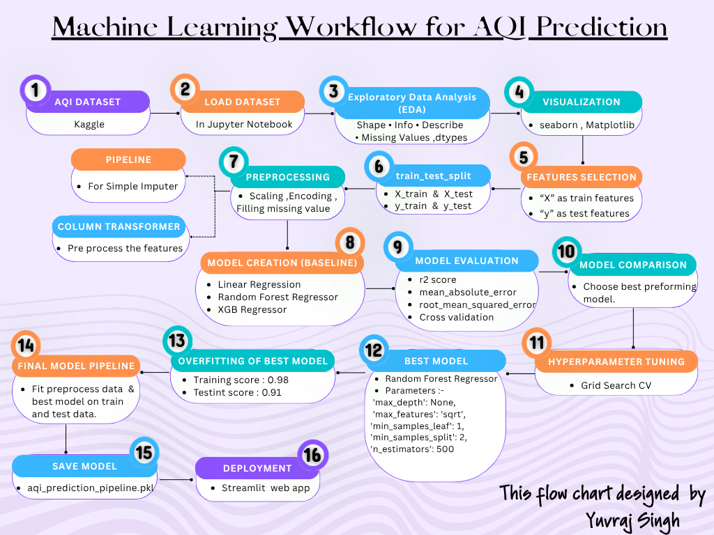

# Air Quality Index (AQI) Prediction Using Machine Learning

An end-to-end Machine Learning project that predicts the **Air Quality Index (AQI)** using environmental pollutant data. This project covers the complete machine learning workflow, including data preprocessing, exploratory data analysis (EDA), model building, hyperparameter tuning, pipeline creation, model serialization, and deployment using Streamlit.

---

## Problem Statement

Air pollution is one of the most serious environmental challenges affecting human health and quality of life. This project aims to build a Machine Learning model that accurately predicts the Air Quality Index (AQI) using environmental pollutant data.

---

## Project Objectives

* Analyze and understand the AQI dataset.
* Perform data cleaning and preprocessing.
* Handle missing values effectively.
* Compare multiple Machine Learning models.
* Tune the best-performing model using GridSearchCV.
* Build a reusable prediction pipeline.
* Save the trained model using Joblib.
* Develop an interactive Streamlit web application.

---

## Dataset Information

* **Dataset Name:** Air Quality Index (AQI) Dataset
* **Problem Type:** Regression
* **Target Variable:** AQI

### Features

* PM2.5
* PM10
* NO
* NO₂
* NOx
* NH₃
* CO
* SO₂
* O₃
* Benzene
* Toluene
* Xylene
---

## Workflow Diagram



---

## Technologies Used

* Python
* Pandas
* NumPy
* Matplotlib
* Seaborn
* Scikit-learn
* Random Forest Regressor
* XGBoost Regressor
* GridSearchCV
* Joblib
* Streamlit

---

## Machine Learning Models

* Linear Regression
* Random Forest Regressor
* XGBoost Regressor

---

# Model Comparison

| Model | R² Score | MAE | RMSE |
|-------|---------:|----:|------:|
| Linear Regression | 0.8238 | 30.06 | 456.79 |
| **Random Forest** | **0.9097** | **20.48** | **40.65**| 
| XGBoost | 0.8965 | 30.03 | 43.51 |

After comparing all models, **Random Forest Regressor** was selected as the final model based on overall performance.

---
## Hyperparameter Tuning

| Method | GridSearchCV |
|---------|--------------|
| Base Model | Random Forest Regressor |
| Best Model | Random Forest (Tuned) |
| Parameters Tuned | n_estimators =300, max_depth = None, min_samples_split = 2, min_samples_leaf = 1, max_features = 'sqrt |

---

## Model Performance (Random Forest(tuned))

| Metric | Score |
|---------|------:|
| R² Score | 0.91 |
| MAE | 20.78 |
| RMSE | 40.35 |

---
## Overfitting Analysis 

| Model | Training Score | Testing Score | Status |
|--------|---------------:|--------------:|--------|
| Random Forest | 0.9868 | 0.9110 | Acceptable |

The Random Forest model demonstrates strong predictive performance with a **Training Score of 0.9868** and a **Testing Score of 0.9110**. The small performance gap indicates good generalization capability with minimal overfitting, making it the most suitable model for deployment.

---


## Project Structure

```text
Air-Quality-Index-Predictor/
│
├── AQI_Prediction.ipynb
├── app.py
├── air_quality_dataset.csv
├── aqi_prediction_pipeline.pkl
├── workflow.png
├── requirements.txt
└── README.md
```


---

## AQI Categories

| AQI Range | Category |
|-----------|----------|
| 0 - 50 | Good |
| 51 - 100 | Satisfactory |
| 101 - 200 | Moderate |
| 201 - 300 | Poor |
| 301 - 400 | Very Poor |
| 401 - 500 | Severe |


---

## Author

**Yuvraj Singh**

GitHub: https://github.com/yuvrajsinghind07


